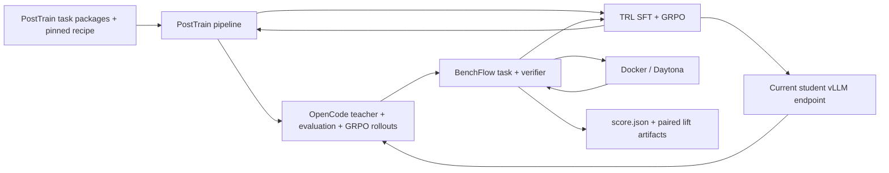

# BenchFlow task-list post-training pipeline

This is the canonical operator guide for the public organizer-side training
implementation under
[`pipelines/benchflow-task-posttrain/`](../pipelines/benchflow-task-posttrain).
It accepts explicit training and held-out evaluation task lists and produces a
versioned score report after SFT and GRPO.

For the broader system boundaries and compatibility matrix, including the
implemented OpenEnv adapter boundary, see
[`architecture-status.md`](architecture-status.md).

```text
training task list + held-out eval task list + pinned TOML recipe
    -> snapshot task packages from Hugging Face
    -> reject canonical package-content overlap across train and eval
    -> synchronize the pinned base checkpoint to the shared vLLM endpoint
    -> evaluate the served base model through OpenCode
    -> collect one verifier-approved teacher trajectory per training task through OpenCode
    -> convert and validate native TRL prompt/completion/tools SFT data
    -> train one LoRA SFT epoch and save adapter + merged checkpoint
    -> synchronize SFT weights to the student vLLM endpoint
    -> evaluate the served student model on a training-task reward gate
    -> run OpenCode rollouts through TRL GRPOTrainer.rollout_func
    -> train LoRA GRPO over all training tasks and save adapter + merged checkpoint
    -> evaluate the served final model through OpenCode on held-out tasks
    -> write paired lift and score reports
```

BenchFlow owns task snapshots, Daytona or Docker sandboxes, verifiers, reward
extraction, rollout artifacts, and paired evaluation. OpenCode owns the teacher
evaluation, and GRPO agent loops. TRL owns SFT and GRPO optimization plus vLLM
weight synchronization. The pipeline is Harbor-free and does not translate
Harbor trajectories.

The organizer recipe pins the public BenchFlow-native conversions:

- `benchflow/data_agent_rl_environment_train` (`2,238` training tasks)
- `benchflow/data_agent_rl_environment_eval` (`366` held-out tasks)

Both repositories use `task.md`, `environment/`, and `verifier/` directly.

A real one-train/one-held-out OpenEnv run completed the full snapshot, teacher,
SFT, forced-GRPO, final-eval, and publication path on these revisions. See
[`native-dataset-openenv-smoke.md`](native-dataset-openenv-smoke.md) for the
exact evidence and claim boundary.

OpenEnv remains a standalone protocol adapter around the same BenchFlow engine,
but it is not used by the current training pipeline. The adapter exposes a real
served `Environment` and typed `EnvClient`; it does not duplicate BenchFlow task
loading, sandboxes, verifiers, rewards, or artifacts.

SFT optimization consumes BenchFlow's native `trl-sft` prompt/completion/tools
rows into pre-tokenized `input_ids` and labels that begin at the exact
prompt/full-conversation common prefix. This avoids Qwen3.5 chat-template mask
drift while training only the intended completion suffix. It does not call the
environment. Environment interaction occurs during teacher collection,
evaluation, the reward gate, and GRPO rollouts.



## Public contract

```bash
posttrainarena-train validate --config <recipe.toml>
posttrainarena-train plan --config <recipe.toml> [--run-name <name>]
posttrainarena-train run --config <recipe.toml> [--run-name <name>] [--dry-run]
posttrainarena-train run --config <recipe.toml> --run-name <name> --resume
```

Commands write machine-readable JSON to stdout. Operational command logs go to
stderr. The final result is:

```text
runs/<run-name>/reports/score.json
```

The score records exact model and dataset revisions, task IDs, baseline and
post-training scores, lift, GRPO gate score, whether GRPO was planned or ran,
the pinned BenchFlow commit, and the stage command trace.

## Install

Python 3.12 and `uv` are recommended:

```bash
git clone https://github.com/benchflow-ai/posttrainarena.git
cd posttrainarena/pipelines/benchflow-task-posttrain
uv venv .venv --python 3.12
uv pip install --python .venv/bin/python -e '.[train,test]'
source .venv/bin/activate
```

For a fresh GPU host:

```bash
bash pipelines/benchflow-task-posttrain/scripts/bootstrap_gpu.sh
source "$HOME/posttrainarena/activate-posttrain.sh"
```

Set `REPO_REF` to a tag or commit SHA when reproducing a specific revision.
The bootstrap installs Torch from its CUDA-specific index, then installs a
content-addressed official vLLM `cu129` wheel directly because the plain PyPI
vLLM 0.23.0 wheel targets CUDA 13 and cannot load on the CUDA 12.x H100 image
used by the reference topology. This avoids unsafe cross-index dependency
resolution. Override `VLLM_CUDA_VARIANT`, `VLLM_WHEEL_BUILD`, and
`UV_TORCH_BACKEND` together for another reviewed wheel family.
The host bootstrap also installs `ninja-build`, which FlashInfer requires when
it JIT-compiles Qwen3.5 kernels on first use.

## Qwen3.5 organizer recipe

[`configs/qwen3.5-9b-data-agent-full.toml`](../pipelines/benchflow-task-posttrain/configs/qwen3.5-9b-data-agent-full.toml)
pins `Qwen/Qwen3.5-9B`, records the declared
`Qwen/Qwen3.5-397B-A17B` teacher source, all 2,238 training tasks, and all 366
held-out tasks. It requires complete
teacher coverage, runs one SFT epoch, and always runs one GRPO epoch. Both
optimization stages use bf16 LoRA without quantization. Completion logging is
disabled and the full recipe does not export participant prompts to W&B. The
canonical task runtime is Docker on a native Linux GPU host; Daytona remains an
optional compatibility path.

The minimal 1x1 validation recipe is
[`configs/qwen3.5-9b-data-agent-canary.toml`](../pipelines/benchflow-task-posttrain/configs/qwen3.5-9b-data-agent-canary.toml).
The domain-matched eight-train/three-eval recipe is
[`configs/qwen3.5-9b-data-agent-soccer-canary.toml`](../pipelines/benchflow-task-posttrain/configs/qwen3.5-9b-data-agent-soccer-canary.toml).
The current teacher/provider and TRL conversion evidence is recorded in
[`qwen35-opencode-teacher-canary.md`](qwen35-opencode-teacher-canary.md).

## No-spend validation

Validate the Qwen3.5 canary and inspect the complete possible stage path without
downloading model weights, calling a provider, starting Daytona, or using a GPU:

```bash
cd pipelines/benchflow-task-posttrain

posttrainarena-train validate \
  --config configs/qwen3.5-9b-data-agent-canary.toml

posttrainarena-train plan \
  --config configs/qwen3.5-9b-data-agent-canary.toml \
  --run-name local-review

posttrainarena-train run \
  --config configs/qwen3.5-9b-data-agent-canary.toml \
  --run-name local-review \
  --dry-run
```

Dry-run records the full possible path, including conditional GRPO. Therefore
`grpo_planned` may be true while `grpo_ran` remains false.

## Recipe structure

| Table | Responsibility |
|---|---|
| `[model]` | Base model ID and immutable model revision |
| `[train_dataset]` | HF task repository, revision, path, and training task-list file |
| `[eval_dataset]` | Separate HF repository/revision and held-out task-list file |
| `[runtime]` | Daytona/Docker sandbox, GRPO completion-token budget, and generation count |
| `[harness]` | Required OpenCode contract, skill mode, telemetry, concurrency, and setup/idle/wall-clock timeouts for teacher collection and evaluation |
| `[evaluation]` | Environment-variable names for the served base/student model aliases and OpenAI-compatible endpoint credentials |
| `[teacher]` | Provider-qualified teacher route, declared source identity/revision, adaptive attempts, reward threshold, post-run token/tool acceptance ceilings, and all-task coverage policy |
| `[sft]` | Enable flag, epoch or smoke-step schedule, optimizer settings, tokenizer-aware message-window length, and LoRA dimensions |
| `[grpo]` | Enable flag, epoch or smoke-step schedule, run policy, gate threshold/count, LoRA settings, rollout/generation batching, retries, and trainer-side vLLM URL environment variable |
| `[tracking]` | W&B or disabled reporting |
| `[output]` | Run root relative to the recipe |

Training and eval task IDs must be non-empty and disjoint. Dataset and model
revisions should be immutable commit SHAs. Add explicit task-list files for new
recipes instead of hiding task selection in code.

## Credentials

Load credentials from a secret manager or untracked environment file. Never put
secret values in a recipe, command, report, or commit.

The example Daytona recipe expects:

- `HF_TOKEN` when private or gated snapshots require it
- `DAYTONA_API_KEY` for sandbox creation
- `OPENROUTER_API_KEY` for the OpenCode-driven Qwen3.5-397B-A17B teacher
- `BENCHFLOW_BASE_MODEL` and `BENCHFLOW_ADAPTER_MODEL` for the OpenCode
  baseline and current-student model aliases
- `BENCHFLOW_PROVIDER_BASE_URL` and `BENCHFLOW_PROVIDER_API_KEY` for the
  OpenAI-compatible model endpoint used by OpenCode evaluation
- `BENCHFLOW_MODEL_BRIDGE_CONTROL_URL` when the trainer should resolve sampled
  logprobs through a local bridge URL instead of public ingress
- `TRL_VLLM_SERVER_BASE_URL` for TRL's local/control connection to the same
  vLLM server used by OpenCode through the public provider URL
- `WANDB_API_KEY` when `tracking.report_to = "wandb"`
- any task-specific credentials required by selected verifiers

TRL's server-mode weight synchronization requires the trainer and vLLM server
to use different physical CUDA devices. On one two-GPU machine, launch the
server with `CUDA_VISIBLE_DEVICES=1 posttrainarena-vllm-serve ...` and the pipeline with
`CUDA_VISIBLE_DEVICES=0`. The public bridge can remain CPU-only.

Provider credential values are not written to the run plan or score report.
BenchFlow removes upstream provider keys from the OpenCode environment and
replaces them with a per-run LiteLLM proxy token. Do not pass raw provider keys
through `--agent-env`; participant tasks must only see the scoped proxy route.
The model bridge answers OpenCode's title-generator prompt locally with a fixed
title, so that helper cannot consume model traffic or block task solving.
It also converts OpenCode's stringified follow-up tool arguments back to JSON
objects before Qwen3.5 chat-template rendering.
The bridge fits each served prompt to the configured model context by truncating
oldest tool outputs only; system and user instructions are never truncated.

## Execute and resume

```bash
posttrainarena-train run \
  --config configs/qwen3.5-9b-data-agent-full.toml \
  --run-name qwen35-9b-data-agent

posttrainarena-train run \
  --config configs/qwen3.5-9b-data-agent-full.toml \
  --run-name qwen35-9b-data-agent \
  --resume
```

Resume reuses snapshots, evaluation metrics, converted SFT data, and checkpoints
only after validating the persisted run plan, exact task IDs, teacher
selection, SFT-data digest, checkpoint digests, evaluation identity, and
evaluation health artifacts. Use a new run name when changing a recipe or task
list.

The snapshot boundary also rejects byte-equivalent task packages under
different task IDs after normalizing the package's declared task name. This is
an exact-content leakage check; organizer review must still perform a separate
semantic leakage audit before private competition evaluation.

The configured student endpoint must expose `BENCHFLOW_ADAPTER_MODEL`.
The Qwen3.5 recipes synchronize the pinned base checkpoint before baseline
evaluation so a server reused from an earlier run cannot contaminate the
reference score. Post-SFT and post-GRPO weights are synchronized through
`TRL_VLLM_SERVER_BASE_URL`; OpenCode reaches the same server through the public
`model-bridge` URL in `BENCHFLOW_PROVIDER_BASE_URL`. Evaluation and GRPO fail closed on missing
endpoint configuration, incomplete token telemetry, missing or malformed LLM
trajectories, unscored rows, missing sampled logprobs, tokenizer drift, or
action-token budget overflow. A scored zero-tool completion is retained as
model behavior, usually with reward `0`; verified teacher selection still
requires at least one tool call.

Tool-bearing baseline, post-SFT, gate, and final agent requests default to
`temperature=1.0, seed=0`. The fixed seed makes task behavior reproducible
while preserving Qwen3.5 tool use; lower-temperature and greedy decoding can
stall before the first tool call. OpenCode title/summary helpers are not seeded.
GRPO rollout requests opt into sampled-token logprobs and do not receive a
forced seed, preserving within-group reward variance without making pass-rate
comparisons depend on uncontrolled random decoding.

The evaluator itself has a real SkillsBench + Daytona canary with score `1.0`,
complete provider telemetry, and healthy `results.jsonl` and
`llm_trajectory.jsonl` artifacts. See
[`opencode-evaluation-canary.md`](opencode-evaluation-canary.md).
The GRPO rollout format and endpoint topology are documented in
[`opencode-grpo.md`](opencode-grpo.md).
The real OpenCode-only SFT-to-GRPO validation is documented in
[`opencode-grpo-smoke.md`](opencode-grpo-smoke.md).
The Qwen3.5 Data Agent eight-train/three-eval run is documented in
[`qwen35-data-agent-e2e-canary.md`](qwen35-data-agent-e2e-canary.md).

## SFT, RL-only, and reward gating

The organizer path collects one verified teacher rollout for every training
task, trains one SFT epoch, records the SFT held-out score, then runs one LoRA
GRPO epoch over the full training set.

Teacher retries inspect only the newly completed attempt and retain selection
state incrementally. GRPO runs the generations in each trainer batch
concurrently up to `[harness].concurrency`, while preserving prompt order in the
TRL rollout contract.

For RL-only experiments, disable both SFT and the teacher:

```toml
[sft]
enabled = false

[teacher]
enabled = false
```

GRPO then starts from the pinned base model. It still gates on training tasks;
the held-out eval set is never used to decide whether to train. Set
`[grpo].enabled = false` for SFT-only runs.

The Qwen3.5 organizer recipe uses `run_policy = "always"` so every submission
receives the same SFT→GRPO procedure. `run_policy = "on_reward"` remains
available for low-cost experiments. The held-out eval set is never used to
decide whether to train.

## Run artifacts

Each run is self-contained:

```text
runs/<run-name>/
  train_task_ids.txt
  eval_task_ids.txt
  data/                       pinned tasks and verified SFT JSONL
  jobs/                       BenchFlow rollout/eval artifacts
  checkpoints/               SFT adapter/merged model and GRPO adapter/merged model
  results/                    baseline, SFT, gate, and final metrics
  reports/
    plan.json
    sft_conversion.json
    EVAL_LIFT.md
    eval_lift.json
    SCORE.md
    score.json
```

Conditional artifacts may be absent. Generated runs, checkpoints, trajectories,
and raw provider responses are ignored by Git and must not be committed.
When a model repository is configured, publishing uploads the final merged
model, the SFT and GRPO adapters, and the SFT merge that the GRPO adapter uses
as its immutable base. Each adapter contains `adapter_dependency.json`; the
GRPO manifest points to the published sibling `../sft-merged`.

## Compute expectations

The Qwen3.5 recipe requires separate physical devices for the trainer and TRL
vLLM worker. Two H100 80 GB GPUs are the initial canary topology. Exact memory
and runtime depend on completion length, generation count, sandbox latency,
and task trajectory length. Run the 1x1 canary before the full 2,238-task run.
The checked-in GRPO recipe trains one same-prompt pair at a time: two
generations, generation batch two, and no gradient accumulation. This keeps
long OpenCode trajectories within the 80 GB trainer GPU without reducing the
one-epoch task coverage. The bootstrap also enables PyTorch expandable CUDA
segments to reduce allocator fragmentation, and the GRPO trainer clears cached
CUDA allocations between steps.

Use W&B for spendful runs to track training loss and GPU utilization. Terminate
GPU hosts after artifacts and checkpoints are backed up.

## Historical validation evidence and limits

The retained Qwen3-4B recipe mirrors a completed H100 smoke with:

- 15 training tasks and two held-out eval tasks
- 15/15 verifier-approved, tool-bearing teacher trajectories
- 40 LoRA SFT steps and a merged Qwen3-4B checkpoint
- baseline held-out score `0.0`
- SFT held-out score `0.0`
- four-task GRPO gate score `0.0`
- GRPO correctly skipped
- final paired delta `0.0`

This validates task loading, sandbox/tool execution, verification, SFT data
conversion, training, reward gating, reporting, and the skip path. It does not
demonstrate model-quality lift. Quality claims require larger training and
held-out sets with non-zero reward signal.

## Development checks

```bash
python3 -m pip install -e 'pipelines/benchflow-task-posttrain[test]'
python3 -m pytest pipelines/benchflow-task-posttrain/tests -q
python3 -m py_compile \
  pipelines/benchflow-task-posttrain/src/posttrainarena/benchflow_pipeline/*.py
bash -n pipelines/benchflow-task-posttrain/scripts/bootstrap_gpu.sh
```

CI installs the package and runs `validate`, `plan`, and `run --dry-run` using
the checked-in recipe.

## Hugging Face Jobs and benchmark matrices

The same pipeline runs through an HF UV Job without a second trainer
implementation. The launcher uploads a portable config bundle, passes only
named secrets to the Job API, and pins the PostTrain Arena Git commit.

Use [`hf-jobs.md`](hf-jobs.md) for the full handoff. The checked-in
`qwen3-4b-hf-job-smoke.toml` performs one SFT step and one forced GRPO step.
`multi-benchmark-smoke.toml` evaluates the resulting checkpoint on Data Agent
and SkillsBench and writes:

```text
runs/<run-name>/reports/benchmarks/summary.json
```

The Hub publisher records run artifacts, checkpoint provenance, job state,
per-benchmark scores, and macro delta in the continuous leaderboard dataset.
