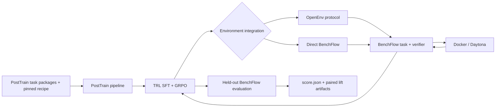

# BenchFlow task-list post-training pipeline

This is the canonical operator guide for the public organizer-side training
implementation under
[`pipelines/benchflow-task-posttrain/`](../pipelines/benchflow-task-posttrain).
It accepts explicit training and held-out evaluation task lists and produces a
versioned score report after SFT and optional GRPO.

For the broader system boundaries and compatibility matrix, including the
implemented OpenEnv adapter boundary, see
[`architecture-status.md`](architecture-status.md).

```text
training task list + held-out eval task list + pinned TOML recipe
    -> snapshot task packages from Hugging Face
    -> evaluate the base model
    -> collect verifier-approved teacher trajectories through OpenCode
    -> convert and validate tool-aware SFT data
    -> train and merge a LoRA SFT checkpoint
    -> evaluate a training-task reward gate
    -> run GRPO according to the configured run policy
    -> evaluate the final model on held-out tasks
    -> write paired lift and score reports
```

BenchFlow owns task snapshots, Daytona or Docker sandboxes, verifiers, reward
extraction, rollout artifacts, and paired evaluation. OpenCode owns the teacher
agent loop. TRL owns SFT and GRPO optimization. Evaluation and GRPO still use
the legacy TRL-owned `run_bash` / `submit` loop during this migration stage.
The pipeline is Harbor-free and does not translate Harbor trajectories.

The default recipes pin the public BenchFlow-native conversions:

- `benchflow/data_agent_rl_environment_train` (`2,238` training tasks)
- `benchflow/data_agent_rl_environment_eval` (`366` held-out tasks)

Both repositories use `task.md`, `environment/`, and `verifier/` directly.

A real one-train/one-held-out OpenEnv run completed the full snapshot, teacher,
SFT, forced-GRPO, final-eval, and publication path on these revisions. See
[`native-dataset-openenv-smoke.md`](native-dataset-openenv-smoke.md) for the
exact evidence and claim boundary.

OpenEnv is an optional protocol adapter in front of the same BenchFlow engine.
The adapter exposes a real served `Environment` and typed `EnvClient`; it does
not duplicate BenchFlow task loading, sandboxes, verifiers, rewards, artifacts,
or held-out evaluation.

`runtime.openenv_url` currently supports only deployments that share the task
snapshot and BenchFlow artifact filesystem with the pipeline process. A fully
remote deployment needs a future task-resolution and artifact-transfer protocol.

SFT optimization consumes verified tool-aware rows and does not call the
environment. Environment interaction occurs during teacher collection,
evaluation, the reward gate, and GRPO rollouts.



## Public contract

```bash
posttrainarena-train validate --config <recipe.toml>
posttrainarena-train plan --config <recipe.toml> [--run-name <name>]
posttrainarena-train run --config <recipe.toml> [--run-name <name>] [--dry-run]
posttrainarena-train run --config <recipe.toml> --run-name <name> --resume
```

Commands write machine-readable JSON to stdout. Operational command logs go to
stderr. The final result is:

```text
runs/<run-name>/reports/score.json
```

The score records exact model and dataset revisions, task IDs, baseline and
post-training scores, lift, GRPO gate score, whether GRPO was planned or ran,
the pinned BenchFlow commit, and the stage command trace.

## Install

Python 3.12 and `uv` are recommended:

```bash
git clone https://github.com/benchflow-ai/posttrainarena.git
cd posttrainarena/pipelines/benchflow-task-posttrain
uv venv .venv --python 3.12
uv pip install --python .venv/bin/python -e '.[train,test]'
source .venv/bin/activate
```

For a fresh GPU host:

```bash
bash pipelines/benchflow-task-posttrain/scripts/bootstrap_gpu.sh
source "$HOME/posttrainarena/activate-posttrain.sh"
```

Set `REPO_REF` to a tag or commit SHA when reproducing a specific revision.

## No-spend validation

The checked-in smoke recipe is
[`configs/qwen3-4b-data-agent-smoke.toml`](../pipelines/benchflow-task-posttrain/configs/qwen3-4b-data-agent-smoke.toml).
Validate it and inspect the complete possible stage path without downloading
model weights, calling a provider, starting Daytona, or using a GPU:

```bash
cd pipelines/benchflow-task-posttrain

posttrainarena-train validate \
  --config configs/qwen3-4b-data-agent-smoke.toml

posttrainarena-train plan \
  --config configs/qwen3-4b-data-agent-smoke.toml \
  --run-name local-review

posttrainarena-train run \
  --config configs/qwen3-4b-data-agent-smoke.toml \
  --run-name local-review \
  --dry-run
```

Dry-run records the full possible path, including conditional GRPO. Therefore
`grpo_planned` may be true while `grpo_ran` remains false.

## Recipe structure

| Table | Responsibility |
|---|---|
| `[model]` | Base model ID and immutable model revision |
| `[train_dataset]` | HF task repository, revision, path, and training task-list file |
| `[eval_dataset]` | Separate HF repository/revision and held-out task-list file |
| `[runtime]` | Direct/OpenEnv integration, Daytona/Docker sandbox, tool limits, generation counts, and vLLM toggle |
| `[harness]` | Required OpenCode contract, skill mode, telemetry, concurrency, and setup/idle/wall-clock timeouts; currently applied to teacher collection while evaluation and GRPO migrate in follow-up releases |
| `[teacher]` | Provider-qualified teacher model, adaptive attempts, reward threshold, post-run token/tool acceptance ceilings, and required verified rows |
| `[sft]` | Enable flag, optimizer settings, sequence length, and LoRA dimensions |
| `[grpo]` | Enable flag, run policy, training-task gate threshold/count, optimizer settings, and steps |
| `[tracking]` | W&B or disabled reporting |
| `[output]` | Run root relative to the recipe |

Training and eval task IDs must be non-empty and disjoint. Dataset and model
revisions should be immutable commit SHAs. Add explicit task-list files for new
recipes instead of hiding task selection in code.

## Credentials

Load credentials from a secret manager or untracked environment file. Never put
secret values in a recipe, command, report, or commit.

The example Daytona recipe expects:

- `HF_TOKEN` when private or gated snapshots require it
- `DAYTONA_API_KEY` for sandbox creation
- `GLM_API_KEY` and `GLM_BASE_URL` for its OpenCode-driven GLM teacher
- `WANDB_API_KEY` when `tracking.report_to = "wandb"`
- any task-specific credentials required by selected verifiers

Provider credential values are not written to the run plan or score report.

## Execute and resume

```bash
posttrainarena-train run \
  --config configs/qwen3-4b-data-agent-smoke.toml \
  --run-name qwen3-4b-data-agent

posttrainarena-train run \
  --config configs/qwen3-4b-data-agent-smoke.toml \
  --run-name qwen3-4b-data-agent \
  --resume
```

Resume reuses snapshots, evaluation metrics, converted SFT data, and checkpoints
when their expected marker artifacts exist. Use a new run name when changing a
recipe or task list.

## SFT, RL-only, and reward gating

The default path collects verified teacher rollouts, trains SFT, evaluates the
SFT model, then evaluates the GRPO gate on training tasks.

For RL-only experiments, disable both SFT and the teacher:

```toml
[sft]
enabled = false

[teacher]
enabled = false
```

GRPO then starts from the pinned base model. It still gates on training tasks;
the held-out eval set is never used to decide whether to train. Set
`[grpo].enabled = false` for SFT-only runs.

By default, GRPO runs only when reward on the first `[grpo].gate_task_count`
training tasks is at least `[grpo].threshold`. `run_policy = "always"` forces
the stage even at zero reward to validate plumbing; it is not a learning
recommendation. A skipped GRPO stage is a valid result. Larger
experiments should use separate training, development/gate, and final held-out
lists.

## Run artifacts

Each run is self-contained:

```text
runs/<run-name>/
  train_task_ids.txt
  eval_task_ids.txt
  data/                       pinned tasks and verified SFT JSONL
  jobs/                       BenchFlow rollout/eval artifacts
  checkpoints/               SFT adapter, merged SFT, and optional GRPO
  results/                    baseline, SFT, gate, and final metrics
  reports/
    plan.json
    sft_conversion.json
    EVAL_LIFT.md
    eval_lift.json
    SCORE.md
    score.json
```

Conditional artifacts may be absent. Generated runs, checkpoints, trajectories,
and raw provider responses are ignored by Git and must not be committed.

## Compute expectations

The checked-in Qwen3-4B recipe is intended for a single modern datacenter GPU.
An H100 80 GB is the validated reference class for the completed smoke. Exact
memory and runtime depend on completion length, generation count, sandbox
latency, and whether vLLM is enabled. Run `plan` and a small smoke before
scaling task counts or GRPO steps.

Use W&B for spendful runs to track training loss and GPU utilization. Terminate
GPU hosts after artifacts and checkpoints are backed up.

## Validated evidence and limits

The checked-in recipe mirrors a completed H100 smoke with:

- 15 training tasks and two held-out eval tasks
- 15/15 verifier-approved, tool-bearing teacher trajectories
- 40 LoRA SFT steps and a merged Qwen3-4B checkpoint
- baseline held-out score `0.0`
- SFT held-out score `0.0`
- four-task GRPO gate score `0.0`
- GRPO correctly skipped
- final paired delta `0.0`

This validates task loading, sandbox/tool execution, verification, SFT data
conversion, training, reward gating, reporting, and the skip path. It does not
demonstrate model-quality lift. Quality claims require larger training and
held-out sets with non-zero reward signal.

## Development checks

```bash
python3 -m pip install -e 'pipelines/benchflow-task-posttrain[test]'
python3 -m pytest pipelines/benchflow-task-posttrain/tests -q
python3 -m py_compile \
  pipelines/benchflow-task-posttrain/src/posttrainarena/benchflow_pipeline/*.py
bash -n pipelines/benchflow-task-posttrain/scripts/bootstrap_gpu.sh
```

CI installs the package and runs `validate`, `plan`, and `run --dry-run` using
the checked-in recipe.

## Hugging Face Jobs and benchmark matrices

The same pipeline runs through an HF UV Job without a second trainer
implementation. The launcher uploads a portable config bundle, passes only
named secrets to the Job API, and pins the PostTrain Arena Git commit.

Use [`hf-jobs.md`](hf-jobs.md) for the full handoff. The checked-in
`qwen3-4b-hf-job-smoke.toml` performs one SFT step and one forced GRPO step.
`multi-benchmark-smoke.toml` evaluates the resulting checkpoint on Data Agent
and SkillsBench and writes:

```text
runs/<run-name>/reports/benchmarks/summary.json
```

The Hub publisher records run artifacts, checkpoint provenance, job state,
per-benchmark scores, and macro delta in the continuous leaderboard dataset.
